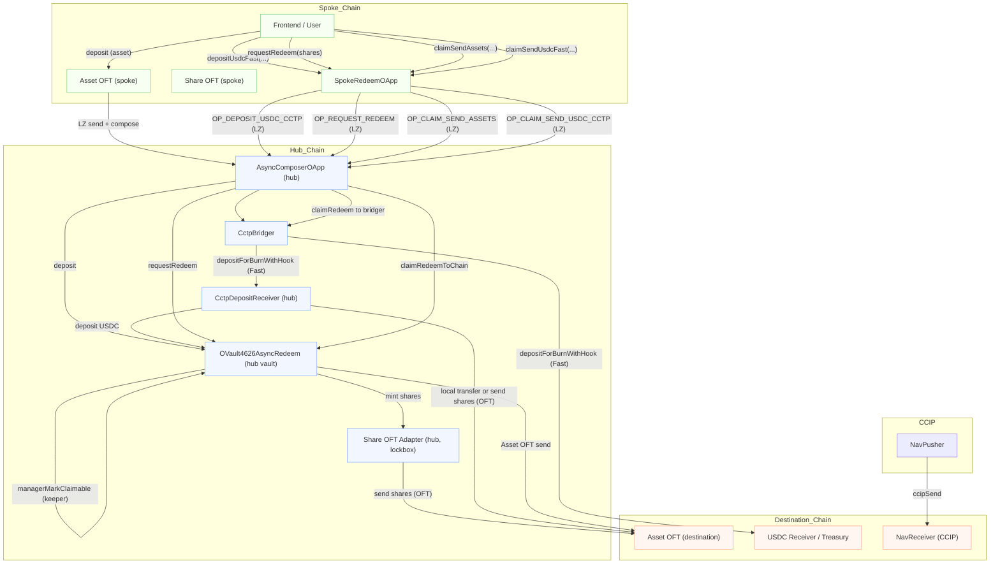

# Pika Vault — Omnichain RWA Yield Vault

An omnichain ERC‑4626 vault with sync deposits, async redemptions, native USDC bridging (CCTP v2), and cross‑chain NAV broadcasting (CCIP). Deposit anywhere, queue redemptions asynchronously, and receive native USDC on a destination chain while control/state (NAV) is propagated separately.

[](https://youtu.be/5o7D5INkY30)




## Prize tracks we’re entering
- **LayerZero — Best Omnichain Interaction**: Async‑redeem via OApps (spoke → hub) with subsequent actions (claim + delivery), demonstrating non‑trivial state coordination beyond simple token transfer. References: [OApp](https://docs.layerzero.network/v2/developers/evm/oapp/overview), [Composer](https://docs.layerzero.network/v2/developers/evm/composer/overview), [OVault](https://docs.layerzero.network/v2/developers/evm/ovault/overview), [OFT](https://docs.layerzero.network/v2/developers/evm/oft/quickstart). Also see the official prize list: [ETHGlobal NYC Prizes](https://ethglobal.com/events/newyork2025/prizes).
- **LayerZero — Best Omnichain DeFi Primitive**: Omnichain ERC‑4626 with share lockbox and asset/share OFTs, enabling deposit anywhere → redeem anywhere. 
- **Chainlink CCIP**: Cross‑chain NAV broadcast (control plane) decoupled from value transfer. Starter/refs: [ccip-starter-kit-foundry](https://github.com/smartcontractkit/ccip-starter-kit-foundry).
- **Circle CCTP**: Native USDC movement (burn on source, mint on destination) for claim and deposit settlement (Fast supported).

## Demo flow (2–3 minutes)
1) **Sync deposit (any chain)**
- User deposits underlying and receives shares (locally or via OFT).

2) **Async redeem request (spoke)**
- User calls `SpokeRedeemOApp.requestRedeemOnSpoke(controller, shares)`.
- Spoke burns share OFT and sends LayerZero `REQUEST_REDEEM` to the hub.

3) **Hub enqueues**
- `AsyncComposerOApp` (hub) `lzReceive` → `vault.requestRedeem(...)`.
- Shares are locked at the vault; `pendingRedeem[controller]` increases.

4) **Manager marks claimable (hub)**
- Keeper frees liquidity, calls `vault.managerMarkClaimable(controller, shares)` → `claimableRedeem` increases.

5) **Claim and bridge delivery**
- Controller (or approved operator) triggers claim:
  - Vault burns locked shares and delivers underlying:
    - Asset OFT `send` to `dstEid` receiver, or
    - CCTP v2 burn+mint USDC to destination treasury/receiver.

6) **NAV broadcast**
- `NavPusher.pushNAV(...)` sends CCIP message. `NavReceiver` updates `lastNAV` on destination — UIs/guards can read it for limits.

## Architecture
- **Vault (hub)**: `contracts/OVault4626AsyncRedeem.sol`
  - ERC‑4626 accounting; async queues per controller; operator approvals (smart‑account friendly).
  - Claim path finalizes accounting; then either approves underlying to Asset OFT and `send`s cross‑chain, or triggers CCTP v2 via `bridge/CctpBridger.sol`.
- **LayerZero OApps (async)**
  - Spoke: `contracts/async/SpokeRedeemOApp.sol` — burns share OFT and sends `REQUEST_REDEEM` / optional `CLAIM_SEND_ASSETS`.
  - Hub: `contracts/async/AsyncComposerOApp.sol` — trusted receiver; on request calls `vault.requestRedeem(...)`; on claim calls `vault.claimRedeemToChain(...)`.
  - Codec: `contracts/async/AsyncCodec.sol` — typed encoders/decoders for the two message types.
- **Token mobility (OFTs)**
  - `contracts/MyAssetOFT.sol` (asset mobility).
  - `contracts/MyShareOFT.sol` (share mobility on spokes; hub uses lockbox adapter).
- **Control plane (CCIP)**: `contracts/ccip/NavPusher.sol`, `contracts/ccip/NavReceiver.sol`.
- **USDC bridging (CCTP v2)**: `contracts/bridge/CctpBridger.sol`.

## Key contracts & roles
- Hub: `OVault4626AsyncRedeem`, `AsyncComposerOApp`, Share OFT Adapter.
- Spokes: Share OFT, Asset OFT, `SpokeRedeemOApp`.
- CCIP: NAV push/receive.
- CCTP: optional delivery rail for native USDC.

## Setup
- Requirements: Node.js ≥ 18.18, pnpm ≥ 8, Foundry (`forge`, `anvil`).
- Install deps:
```bash
pnpm i
```
- Build:
```bash
forge build
# or
pnpm compile
```
- Test:
```bash
forge test --via-ir
```

## Environment
Create `.env` (example keys you’ll need for scripts):
```
# CCIP
CCIP_ROUTER_BASE_SEPOLIA=
CCIP_ROUTER_ARB_SEPOLIA=
CCIP_BASE_SEPOLIA_SELECTOR=

# CCTP v2
CCTP_TOKEN_MESSENGER_V2_BASE=
USDC_BASE=
CCTP_DOMAIN_DEST=
DEST_TREASURY=
CCTP_MAX_FEE=0
CCTP_MIN_FINALITY=1000

# Demo values
NAV_PUSHER_ARB=
CCTP_BRIDGER_ARB=
NAV_RECEIVER_BASE=
AMOUNT_USDC_6DP=
TEST_NAV_E18=
DEPLOYER_PK=
```

## Deploy & run demo
- CCIP NAV
  - Deploy receiver (dest): `script/01_DeployBaseSepolia_NavReceiver.s.sol`
  - Deploy pusher (source): `script/02_DeployArbSepolia_Core.s.sol`
  - Push NAV + (optional) bridge USDC: `script/03_Run_ArbSepolia_BridgeAndPush.s.sol`

- LZ OApps (async redeem)
  - Deploy `AsyncComposerOApp` (hub) + `SpokeRedeemOApp` (spoke).
  - `setPeer`/`_setPeer`, configure EIDs, and whitelist operators.
  - Smoke test `REQUEST_REDEEM` and `CLAIM_SEND_ASSETS` with small amounts.

- End‑to‑end testnet flow (Base hub ↔ Sepolia spoke)
  1) Optional: deploy a 6‑dec Share OFT on Sepolia and redeploy Spoke to point to it
     - Deploy Share OFT (6 dp):
       ```bash
       forge script script/10_DeployShareOFT_Sepolia.s.sol:DeployShareOFT_Sepolia \
         --rpc-url $SEPOLIA_RPC --broadcast -vvvv
       ```
     - Export `SHARE_OFT_SEPOLIA` to the printed address
     - Redeploy Spoke (sets hub automatically in script):
       ```bash
       forge script script/07_DeploySpoke_Sepolia.s.sol:DeploySpoke_Sepolia \
         --rpc-url $SEPOLIA_RPC --broadcast -vvvv
       ```
     - Export `SPOKE_REDEEM_OAPP_SEPOLIA` to the printed address
     - On Base, wire composer → new Spoke (left‑pad address as bytes32):
       ```bash
       cast send $ASYNC_COMPOSER_HUB_BASE "setPeer(uint32,bytes32)" \
         $LZ_EID_SEPOLIA $(cast --to-bytes32 $(cast --to-uint256 $SPOKE_REDEEM_OAPP_SEPOLIA)) \
         --rpc-url $RPC_URL_BASE_TESTNET --private-key $DEPLOYER_PK
       ```

  2) Wire share peers (Base ↔ Sepolia)
     ```bash
     forge script script/09_UserFlows.s.sol:UserFlows --rpc-url $RPC_URL_BASE_TESTNET \
       --sig "base_setSharePeerToSepolia()" --broadcast -vvvv
     forge script script/09_UserFlows.s.sol:UserFlows --rpc-url $SEPOLIA_RPC \
       --sig "sepolia_setSharePeerToBase()" --broadcast -vvvv
     ```

  3) Approvals on Base (controller → composer for shares when pulling in request)
     ```bash
     cast send $VAULT_BASE "approve(address,uint256)" $ASYNC_COMPOSER_HUB_BASE \
       0xffffffffffffffffffffffffffffffffffffffffffffffffffffffffffffffff \
       --rpc-url $RPC_URL_BASE_TESTNET --private-key $CONTROLLER_PK
     ```

  4) Set operator for claim (controller → composer)
     ```bash
     forge script script/09_UserFlows.s.sol:UserFlows --rpc-url $RPC_URL_BASE_TESTNET \
       --sig "base_setOperator()" --broadcast -vvvv
     ```

  5) Send shares from Base to Sepolia (6 dp)
     ```bash
     forge script script/09_UserFlows.s.sol:UserFlows --rpc-url $RPC_URL_BASE_TESTNET \
       --sig "base_sendSharesToSepolia(uint256,address)" 10000 $YOUR_SEPOLIA_EOA \
       --broadcast -vvvv
     ```
     - Verify on Sepolia:
       ```bash
       cast call $SPOKE_REDEEM_OAPP_SEPOLIA "shareOFT()(address)" --rpc-url $SEPOLIA_RPC
       cast call $SHARE_OFT_SEPOLIA "decimals()(uint8)" --rpc-url $SEPOLIA_RPC   # expect 6
       cast call $SHARE_OFT_SEPOLIA "balanceOf(address)(uint256)" $YOUR_SEPOLIA_EOA --rpc-url $SEPOLIA_RPC
       ```

  6) Request redeem on Sepolia (burn spoke shares, LZ to hub)
     - The script auto‑quotes LZ fees and adds a small buffer; Spoke sends with embedded executor options.
     ```bash
     forge script script/09_UserFlows.s.sol:UserFlows --rpc-url $SEPOLIA_RPC \
       --sig "sepolia_requestRedeem(uint256)" 10000 --broadcast -vvvv
     # or burn entire balance
     forge script script/09_UserFlows.s.sol:UserFlows --rpc-url $SEPOLIA_RPC \
       --sig "sepolia_requestRedeemAll()" --broadcast -vvvv
     ```

  7) Mark claimable on Base (6 dp)
     ```bash
     forge script script/09_UserFlows.s.sol:UserFlows --rpc-url $RPC_URL_BASE_TESTNET \
       --sig "base_markClaimable(uint256)" 10000 --broadcast -vvvv
     ```

  8) Withdraw
     - USDC Fast (CCTP), initiated from Sepolia (shares in 6 dp):
       ```bash
       forge script script/09_UserFlows.s.sol:UserFlows --rpc-url $SEPOLIA_RPC \
         --sig "sepolia_claimUsdcFast(uint256,uint256)" 10000 0 --broadcast -vvvv
       ```
     - Local on Base (receive USDC on Base):
       ```bash
       cast send $VAULT_BASE "claimRedeem(uint256,address,address)" \
         10000 $RECEIVER_BASE $CONTROLLER_ADDRESS \
         --rpc-url $RPC_URL_BASE_TESTNET --private-key $CONTROLLER_PK
       ```

  9) Troubleshooting
     - LZ_InsufficientFee: bump Spoke executor gas or let the script’s +5% buffer cover it
       ```bash
       cast send $SPOKE_REDEEM_OAPP_SEPOLIA "setDefaultLzReceive(uint128,uint128)" 400000 0 \
         --rpc-url $SEPOLIA_RPC --private-key $DEPLOYER_PK
       ```
     - Dest revert (ERC20InsufficientAllowance): ensure controller approved composer on Base (step 3)
     - Observe Base queue:
       ```bash
       cast call $VAULT_BASE "pendingRedeem(address)(uint256)" $CONTROLLER_ADDRESS --rpc-url $RPC_URL_BASE_TESTNET
       cast call $VAULT_BASE "claimableRedeem(address)(uint256)" $CONTROLLER_ADDRESS --rpc-url $RPC_URL_BASE_TESTNET
       ```
- User flows (scripts)
  - Set operator (Base): `script/09_UserFlows.s.sol:UserFlows.base_setOperator()`
  - Deposit (Base): `script/09_UserFlows.s.sol:UserFlows.base_deposit(amountAssets)`
  - Wire share peers (Base→Sepolia, Sepolia→Base):
    - `script/09_UserFlows.s.sol:UserFlows.base_setSharePeerToSepolia()`
    - `script/09_UserFlows.s.sol:UserFlows.sepolia_setSharePeerToBase()`
  - Send shares to Sepolia: `script/09_UserFlows.s.sol:UserFlows.base_sendSharesToSepolia(shares,toSepolia)`
  - Request redeem (Sepolia):
    - Fixed amount: `script/09_UserFlows.s.sol:UserFlows.sepolia_requestRedeem(shares)`
    - All balance: `script/09_UserFlows.s.sol:UserFlows.sepolia_requestRedeemAll()`
  - Mark claimable (Base): `script/09_UserFlows.s.sol:UserFlows.base_markClaimable(shares)`
  - Claim via USDC Fast (Sepolia): `script/09_UserFlows.s.sol:UserFlows.sepolia_claimUsdcFast(shares,minAssets)`
  - Deposit via USDC Fast (Sepolia): `script/09_UserFlows.s.sol:UserFlows.sepolia_depositUsdcFast(amountAssets,destDomain,depositReceiver)`

## Security & invariants
- Only trusted OApp peers trigger `_lzReceive` handlers.
- Only `controller` or its approved operator may claim.
- Invariants:
  - Burned shares at claim == shares removed from claimable.
  - Assets paid at claim ≤ available liquidity.
  - Queues: `pendingRedeem` + `claimableRedeem` track requested/claimable accurately.
- Failure modes:
  - LZ message fail → executor retry; handlers are idempotent.
  - CCTP fast transfer cannot finalize → fallback to standard path.
  - CCIP fee underfunded → quote `getFee()` and fund exactly.

## KPIs
- Time to claimable after request (SLA)
- Successful CCTP mints vs attempts
- CCIP finality latency
- TVL; per‑controller claimable

## References
- LayerZero: [OApp](https://docs.layerzero.network/v2/developers/evm/oapp/overview) · [OFT](https://docs.layerzero.network/v2/developers/evm/oft/quickstart) · [Composer](https://docs.layerzero.network/v2/developers/evm/composer/overview) · [OVault](https://docs.layerzero.network/v2/developers/evm/ovault/overview)
- Chainlink CCIP: [ccip-starter-kit-foundry](https://github.com/smartcontractkit/ccip-starter-kit-foundry)
- ETHGlobal NYC 2025: [Prizes](https://ethglobal.com/events/newyork2025/prizes)

## Frontend integration: choose your rail

### Deposits
- **Standard (OFT) — available now**
  - If source = hub: call `vault.deposit(assets, receiver)` directly.
  - If source ≠ hub: call the Asset OFT `send(...)` with a compose message targeting the hub composer (or use an SDK helper) so the hub deposits and mints shares. This is the default, simplest UX.
- **USDC Fast (CCTP) — available now**
  - Call `SpokeRedeemOApp.depositUsdcFast(amountAssets, destDomain, depositReceiver, maxFee>0, minFinality=1000, destCaller, hookData)`.
  - `depositReceiver` is `CctpDepositReceiver` on the hub, which mints USDC, deposits into the vault, and either transfers shares locally or OFT‑sends them cross‑chain.
  - `hookData` should encode `(receiver, shareDstEid, minShares, oftOptions)` for the receiver’s `finalizeDeposit`.

### Claims
- **Standard (OFT)**: The spoke calls `claimSendAssets(...)` on `SpokeRedeemOApp` → hub finalizes claim → Asset OFT `send` to destination `receiver`.
- **USDC Fast (CCTP)**: The spoke calls `claimSendUsdcFast(...)` on `SpokeRedeemOApp` → hub finalizes claim → `CctpBridger.bridgeUSDCV2` with `maxFee>0` and `minFinality=1000` (Fast).

### Runtime switching (suggested UX)
- If the underlying is not USDC → always use OFT rails.
- If the underlying is USDC → show a toggle:
  - OFF → Standard (OFT)
  - ON  → Fast (CCTP v2)

### Minimal params you’ll surface in UI (Fast mode)
- `destDomain` (CCTP domain, e.g., Base=6)
- `mintRecipient` / `depositReceiver` (hub CCTP receivers)
- `maxFee` (>0 to enable Fast)
- `minFinality` (`1000` for Fast, `2000` for Standard)
- Optional: `hookData`, `destCaller`

Notes
- CCIP is separate from value transfer; you can fetch/display `lastNAV` via the `NavReceiver` address on destination.
- For OFT sends, estimate fees with the OFT `quoteSend`; for CCIP, use `router.getFee`; for CCTP Fast, account for `maxFee` and finality.

## Deployed addresses (testnets)

- Base Sepolia (hub)
  - Vault (OVault4626AsyncRedeem): `0x81A7A4Ece4D161e720ec602Ad152a7026B82448b`
  - Share Adapter (MyShareOFTAdapter): `0x6Df71536c389d09E9175ea9585f7DCD1A95B29d3`
  - AsyncComposerOApp (hub): `0xCD771B830C1775308e8EE5B8F582f3956054041c`
  - CCTP Bridger (Base): `0x42Ffc8306c022Dd17f09daD0FF71f7313Df0A48D`
  - CctpDepositReceiver: `0x138108cB4Ae27856d292D52205BBC530A4A4E229`
  - NAV Receiver: `0x77e424Dab916412C04eBe6B8c0435B3202f4C81B`

- Arbitrum Sepolia (spoke)
  - Share OFT (MyShareOFT): `0x6Df71536c389d09E9175ea9585f7DCD1A95B29d3`
  - SpokeRedeemOApp: `0xC91A582E0FB8f2DbFe1309B3f578876564Bd7Ee0`
  - NAV Pusher: `0x77e424Dab916412C04eBe6B8c0435B3202f4C81B`
  - CCTP Bridger (Arb): `0x81A7A4Ece4D161e720ec602Ad152a7026B82448b`

- Ethereum Sepolia (spoke)
  - Share OFT (MyShareOFT): `0x26FAEF8F47277cbD719e17732CA60295e434378e`
  - SpokeRedeemOApp: `0x0935b69d41072e095db332cb97Ff7c2bF0679CDb`
  - Note: If you deploy a new Share OFT, also redeploy SpokeRedeemOApp pointing to it and re‑wire hub peer
